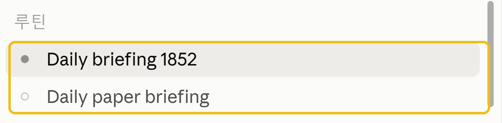
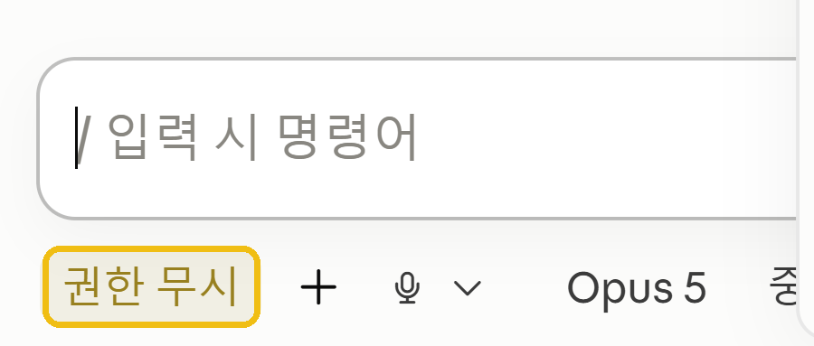

# 연구자를 위한 LLM 에이전트 튜토리얼

[](https://claude.com/claude-code)
[](patch_notes/README.md)

논문 PDF를 개인 지식베이스(LLM Wiki)로 쌓고, 매일 정해진 시간에 관심사 기반 최신 논문
브리핑까지 받는 세팅을 Claude에게 한 줄로 맡기는 튜토리얼입니다.

바뀐 내용은 [패치노트](patch_notes/README.md)에서 확인하세요.

## 사용법 — 이게 전부입니다

[Claude Desktop](https://claude.com/download)을 설치하고, 새 대화에 아래를 붙여넣으세요.

```
https://github.com/ehojune/llm-agent-tutorial-for-researchers
나도 이거 세팅해줘
```

Claude가 이 저장소를 읽고 몇 가지를 물어본 뒤(연구 분야, 위키 버전, 브리핑 시간과 수신
방법) 폴더 생성부터 매일 브리핑 예약까지 알아서 끝냅니다. 위키 폴더를 따로 정하지 않으면
홈 폴더에 `llm-wiki`를 만들어 줍니다.

확장판은 Python이 필요합니다. 없으면 Claude가 세팅 중에 설치해도 되는지 물어보고, 허락하면
알아서 깔아 줍니다.

## 뭐가 세팅되나

1. **LLM Wiki** — `논문 PDF → 요약(sources/) → 위키 페이지(wiki/)` 3단 구조의 개인
   지식베이스. 모든 답이 "실제로 갖고 있는 논문"에 근거하도록 강제하는 4대 규칙(웹 검색
   금지 등)이 핵심입니다. PDF를 주고 "ingest 해줘" 하면 등록 + 요약 + 기존 논문과의 연결
   보고까지 한 번에 해줍니다.
2. **데일리 논문 브리핑** — 관심사를 바탕으로 매일 정해진 시간에 PubMed 최신 논문을 훑어
   브리핑합니다. Claude의 **루틴** 기능으로 돌아갑니다 — 세팅할 때 Claude가 루틴을 대신
   등록해 주고, 그 뒤로는 사이드바의 *루틴*에서 시간을 바꾸거나 잠시 꺼둘 수 있습니다. 수신
   방법은 데스크탑 알림(기본, 설정 불필요), 이메일, Slack, Notion 중 선택. 루틴은 **앱이 켜져
   있을 때** 돌기 때문에, 브리핑 시간에 컴퓨터가 꺼져 있었다면 다음에 위키 폴더에서 Claude를
   열었을 때 밀린 브리핑을 잡아서 해줍니다. 매일 아침 대화창에서 **권한 무시**를 한 번 눌러
   두세요 (아래 참고).
3. **한국어 humanizer 스킬** — [DaleSeo/korean-skills](https://github.com/DaleSeo/korean-skills)의
   `humanizer`를 함께 설치합니다. AI가 쓴 한국어 특유의 패턴 40가지(쉼표 과다, 번역투 등)를
   찾아 자연스럽게 고쳐주는 스킬입니다. 설치 중에 **항상 적용할지, 어디까지 적용할지** 물어봅니다
   — 모든 대화에 적용(권장), 이 위키에서만, 아니면 부를 때만. 항상 적용을 골라도 매번 무거운
   분석을 돌리는 게 아니라 **한국어를 쓸 때 그 패턴들을 피해서 쓰는 기본값**이 되는 것이고,
   기존 글을 고칠 땐 "자연스럽게 해줘" 하면 전체 분석·재작성이 돕니다.

### 루틴 쓸 때 알아둘 것 — 매일 "권한 무시" 한 번

루틴은 매일 **새 대화창**에서 돕니다. 어제 눌러둔 허락이 오늘 대화창으로 이어지지 않아서,
그날 브리핑이 도는 대화창에서 한 번은 **권한 무시**를 눌러줘야 중간에 멈추지 않습니다.

여기서 헷갈리기 쉬운 게 하나 있습니다. 눌러야 하는 곳은 **지금 세팅을 시키고 있는 대화창이
아니라 브리핑 루틴의 대화창**입니다. 왼쪽 사이드바 **루틴** 아래에서 브리핑 항목을 눌러 그
대화창을 연 다음,



입력창 왼쪽 아래의 **권한 무시**를 누르면 됩니다.



브리핑이 하는 일은 위키 폴더 훑기(`scan_interests.py`), PubMed 검색, `briefings/` 파일 쓰기가
전부라 위험한 작업이 없습니다. 매일 눌러야 하는 건 번거롭지만 지금은 이게 최선입니다.
나중에 Slack이나 이메일로 받도록 붙여두면 이 확인도 없이 알아서 돌아갑니다.

## 두 가지 버전

세팅 중에 Claude가 물어봅니다.

| | 원본 (안준용 교수) | 확장판 (이호준) |
|---|---|---|
| 초점 | 논문 지식베이스 그 자체 | 논문 + 연구 생활 전반 |
| 논문 외 자료 | wiki 밖에 격리 (`materials/`, `agenda/`) | 세미나 노트, 프로젝트 미팅, 교과서 스터디, 질문 노트를 wiki에 정식 등록 |
| 브리핑 관심사 | 직접 적은 시드 키워드 | 위키 태그에서 자동 집계 (`scan_interests.py`) + 수동 키워드 |
| 규모 | 수만 편 운영으로 다듬어진 정식 시스템 (로그, 검증기, BM25 검색) | 가볍게 시작하는 개인용 |

원본: [joonan30 gist](https://gist.github.com/joonan30/cbce305684d079dbe9a3fbaefe4e3959) ·
확장판 템플릿: [templates/](templates/)

## 세팅 후 추천 — 프로젝트 베이스 (GitHub 또는 Notion)

위키가 "알게 된 것"을 쌓는 곳이라면, 프로젝트 베이스는 "작업 그 자체"(README, 계획, 코드,
데이터 위치)를 두는 곳입니다. 세팅이 끝난 뒤 아무 때나 Claude에게 **"프로젝트 베이스
만들어줘"** 하면 됩니다.

- 가장 큰 효용: 대화가 길어지거나 다른 에이전트에게 넘길 때 "프로젝트 맥락 전부 README에
  정리해서 저장해줘" 한 뒤 링크만 던지면, 배경 설명을 반복하지 않아도 됩니다.
- **GitHub** — 변경 이력이 전부 남는 온라인 프로젝트 폴더. 에이전트가 연동 설정 없이 바로
  읽고 쓰며, git을 몰라도 "git에 저장해줘"가 곧 commit+push가 되도록 규칙을 넣어줍니다.
- **Notion** — 편집과 공유가 쉽고, 할일 트래커·Notion Calendar 연동이 큰 장점 (Notion MCP
  필요). 검증된 트래커 템플릿 구조가 [templates/project-base.md](templates/project-base.md)에
  들어 있습니다.
- 민감한 연구는 **private 권장** — 언제든 공개로 전환할 수 있고, private여도 지정한 사람을
  초대해 함께 볼 수 있습니다.

## 더 읽을거리

- 짧고 쉬운 소개 (10분): <https://joonan30.github.io/llm-wiki-labs/evolution/>
- 정식 가이드북 (무료 ebook, 긴 호흡): <https://github.com/chaek-union/llm-wiki-for-scientists>

## 위키 구경하기

그래프 뷰로 훑고 싶으면 [Obsidian](https://obsidian.md/)(무료)을 설치하고 wiki 폴더를
Vault로 여세요. 읽기만 하므로 에이전트 작업과 충돌하지 않습니다.


---

## For AI agents

If a user pointed you at this repository and asked to set it up ("나도 이거 세팅해줘",
"set this up for me", or similar): fetch and follow
<https://raw.githubusercontent.com/ehojune/llm-agent-tutorial-for-researchers/main/SETUP.md>.

## Credits

- LLM Wiki 방법론: [안준용 교수, 고려대](https://gist.github.com/joonan30/cbce305684d079dbe9a3fbaefe4e3959) · 원안: [Andrej Karpathy](https://gist.github.com/karpathy/1dd0294ef9567971c1e4348a90d69285)
- 확장판과 브리핑 시스템: 이호준 ([@ehojune](https://github.com/ehojune))
- 한국어 humanizer 스킬: [DaleSeo/korean-skills](https://github.com/DaleSeo/korean-skills) (MIT)
